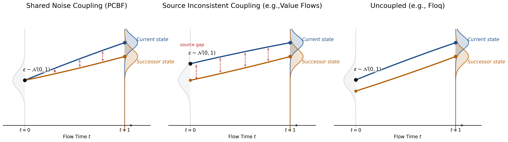
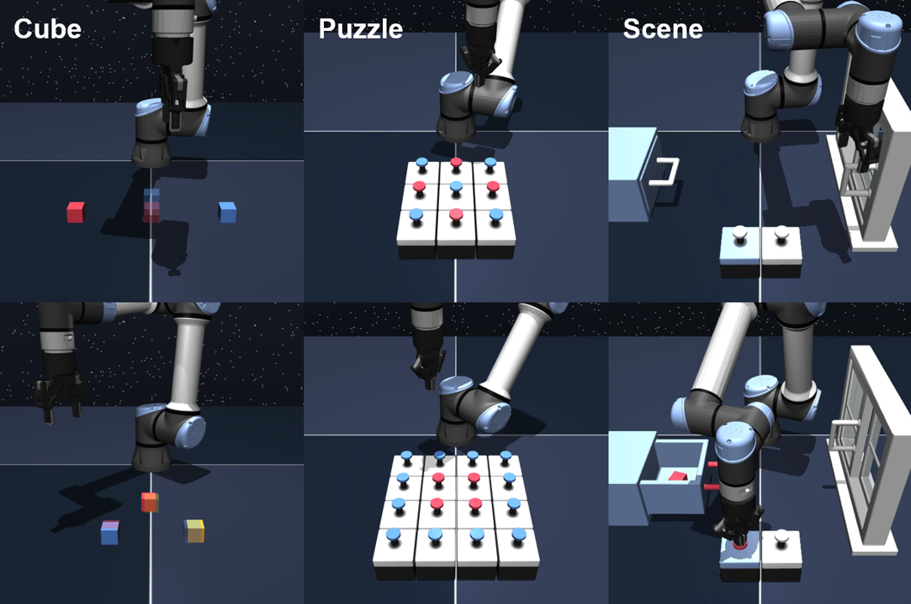
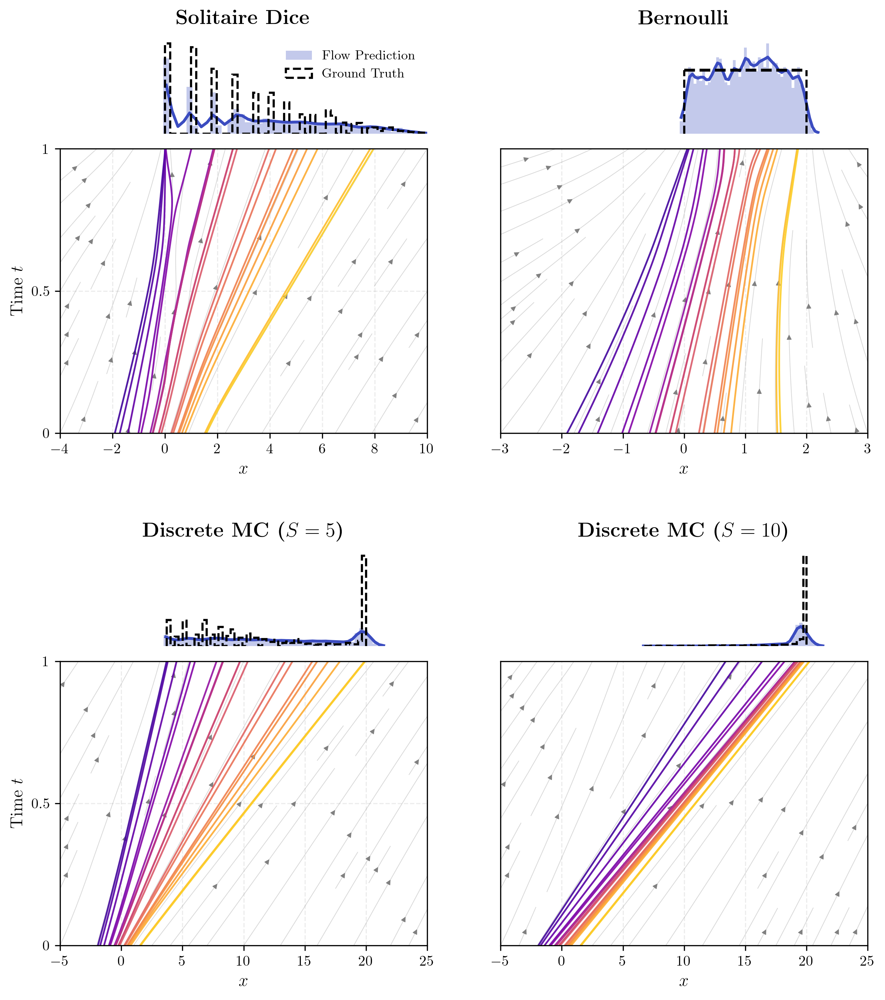
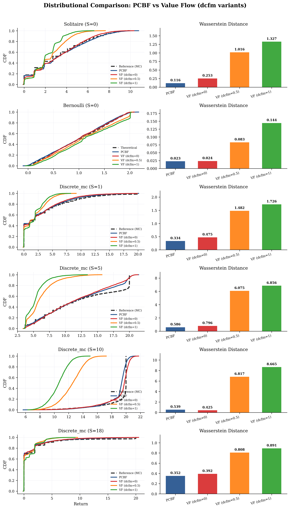

<h1 align="center">Path-Coupled Bellman Flows for Distributional Reinforcement Learning</h1>

<p align="center">
  Official implementation of <b>Path-Coupled Bellman Flows for Distributional Reinforcement Learning</b>
  <br>
  <i>ICML 2026</i>
</p>

<p align="center">
  <a href="https://arxiv.org/abs/2605.08253"></a>
  <a href="https://github.com/BoyangASU/path-coupled-bellman-flows"></a>
  <a href="https://icml.cc"></a>
</p>

<p align="center">
  
  <br>
  <em><b>Figure 1.</b> Architecture of Path-Coupled Bellman Flows (PCBF). A shared noise variable is propagated along the Bellman path, producing a path-consistent flow-matching objective for return distributions.</em>
</p>

<p align="center">
  
  <br>
  <em><b>Figure 2.</b> Demonstration of the trained agent using Path-Coupled Bellman Flows on Discrete MC Environment.</em>
</p>

## Overview

Path-Coupled Bellman Flows (PCBF) introduces a flow-based perspective for distributional reinforcement learning. Rather than treating each return as an independent sample, PCBF couples the noise along a Bellman trajectory, yielding a path-consistent flow-matching objective for the return distribution. The method was accepted as a regular-track paper at ICML 2026.

**Core idea.** Standard flow matching learns a velocity field that transports Gaussian noise $\epsilon$ into return samples. The distributional Bellman equation says the current return equals reward plus a discounted successor return: $Z(s,a) \stackrel{d}{=} R + \gamma Z(s',a')$. PCBF exploits this by using the *same* noise $\epsilon$ to generate both current and successor returns, so their flow paths are geometrically coupled:

$$Z_t^{s'} = (1-t)\cdot \epsilon + t\cdot X', \qquad Z_t^{s} = t\cdot R + \tilde{\gamma}\cdot Z_t^{s'} + (1-t)(1-\tilde{\gamma})\cdot \epsilon$$

Both paths start from the same $\epsilon$ at $t=0$ and reach their Bellman-related endpoints at $t=1$. Differentiating gives the BCFM velocity target $Y = R + \tilde{\gamma}X' - \epsilon$, which is unbiased but high-variance because it depends on the noisy sample $X'$.

PCBF reduces this variance with a control variate built from the successor velocity field, yielding a $\lambda$-parameterized family of targets:

$$u = Y + \lambda\cdot C, \qquad C = v_{\theta^-}(t,\, Z_t^{s'} \mid s', a') - (X' - \epsilon)$$

- $\lambda = 0$: pure BCFM — unbiased, high variance
- $\lambda > 0$: replaces noisy $X'$ with smoother velocity predictions, reducing variance with small controlled bias
- $\lambda = \gamma$: fully eliminates $X'$ from the target

The shared-noise coupling ensures the bias from $\lambda > 0$ is small — scaling as $O((1-\gamma)(1-t))$ under Gaussian analysis — making the bias–variance trade-off favorable in practice.
## Installation

1. Create an Anaconda environment: `conda create -n PCBF python=3.10.13 -y`
2. Activate the environment: `conda activate PCBF`
3. Install the dependencies:

```bash
conda install -c conda-forge glew -y
conda install -c conda-forge mesalib -y
pip install -r requirements.txt
```

## Usage

```bash
# PCBF on OGBench cube-double-play (γ=0.995, λ=0.4)
python main.py --env_name=cube-double-play-singletask-{task1,task2,task3,task4,task5}-v0 --agent=agents/lambda_flow.py --agent.discount=0.995 --agent.lambda_param=0.4

# PCBF on OGBench cube-triple-play (γ=0.995, λ=0.995)
python main.py --env_name=cube-triple-play-singletask-{task1,task2,task3,task4,task5}-v0 --agent=agents/lambda_flow.py --agent.discount=0.995 --agent.lambda_param=0.995

# PCBF on OGBench scene-play (γ=0.99, λ=0.2)
python main.py --env_name=scene-play-singletask-{task1,task2,task3,task4,task5}-v0 --agent=agents/lambda_flow.py --agent.discount=0.99 --agent.lambda_param=0.2

# PCBF on OGBench puzzle-4x4-play (γ=0.99, λ=0.2)
python main.py --env_name=puzzle-4x4-play-singletask-{task1,task2,task3,task4,task5}-v0 --agent=agents/lambda_flow.py --agent.discount=0.99 --agent.lambda_param=0.2

# PCBF on D4RL hammer-cloned (γ=0.99, λ=0.8)
python main.py --env_name=hammer-cloned-v1 --agent=agents/lambda_flow.py --agent.discount=0.99 --agent.lambda_param=0.8

# PCBF on D4RL hammer-expert (γ=0.99, λ=0.9)
python main.py --env_name=hammer-expert-v1 --agent=agents/lambda_flow.py --agent.discount=0.99 --agent.lambda_param=0.9

# PCBF on OGBench visual-antmaze-teleport (γ=0.99, λ=0.0)
python main.py --env_name=visual-antmaze-teleport-navigate-singletask-{task1,task2,task3,task4,task5}-v0 --p_aug=0.5 --frame_stack=3 --agent=agents/lambda_flow.py --agent.discount=0.99 --agent.lambda_param=0.0 --agent.encoder=impala_small

# PCBF on OGBench visual-cube-double-play (γ=0.995, λ=0.9)
python main.py --env_name=visual-cube-double-play-singletask-{task1,task2,task3,task4,task5}-v0 --p_aug=0.5 --frame_stack=3 --agent=agents/lambda_flow.py --agent.discount=0.995 --agent.lambda_param=0.9 --agent.encoder=impala_small
```

## Hyperparameters

Domain-level hyperparameters from the paper (Table 5). λ is tuned per domain on the task marked with *.

| Domain | γ | λ |
|---|---|---|
| cube-double-play | 0.995 | 0.4 |
| cube-triple-play | 0.995 | 0.995 |
| puzzle-4x4-play | 0.99 | 0.2 |
| scene-play | 0.99 | 0.2 |
| visual-antmaze-teleport | 0.99 | 0.0 |
| visual-cube-double-play | 0.995 | 0.9 |

D4RL Adroit uses per-task λ; see `scripts/run_d4rl.sh` for details.

<details>
<summary><b>Common hyperparameters (click to expand)</b></summary>

| Hyperparameter | Value |
|---|---|
| Optimizer | Adam |
| Learning rate | 3×10⁻⁴ |
| Batch size | 256 |
| MLP hidden dims | (512, 512, 512, 512) |
| Activation | GELU |
| Layer norm | Yes |
| Flow steps (Euler) | 10 |
| Rejection sampling candidates | 16 |
| Target network τ | 0.005 |
| Q ensembles | 2 |

</details>

## Results

### OGBench Environments
<p align="center">
  
  <figcaption align="center">
    <b>Figure 3.</b> OGBench Tasks.
  </figcaption>
</p>

### Offline RL (Table 1)

| Domain | IQN | CODAC | FQL | IQL | Value Flows | **PCBF** |
|---|---|---|---|---|---|---|
| cube-double-play | 42±8 | 61±6 | 29±6 | 7±1 | 69±4 | **71±5** |
| scene-play | 40±1 | 55±1 | 56±2 | 28±3 | **59±4** | 54±4 |
| puzzle-4x4-play | 27±4 | 20±18 | 17±5 | 7±2 | 27±4 | **30±4** |
| cube-triple-play | 6±0 | 2±1 | 4±2 | 1±1 | **14±3** | 4±1 |
| D4RL adroit | 66±5 | 69±0 | **71±4** | 70 | 65±2 | 69±2 |

Bold = within 95% of best. Results averaged over 8 seeds.

### Distributional Accuracy (Toy Environments)

<p align="center">
  
  <figcaption align="center">
    <b>Figure 4.</b> Learned PCBF Maps on Toy Environments. Left Top
(Solitaire); Right Top (Bernoulli); and Bottom (Discrete MC).
  </figcaption>
</p>

### Comparison on Learned Distribution (Toy Environments)

<p align="center">
  
  <figcaption align="center">
    <b>Figure 5.</b> Distributional accuracy comparison on toy environments.
  </figcaption>
</p>

### Visualization of Learned Velocity Field (Toy Environments)

<p align="center">
  
  <figcaption align="center">
    <b>Figure 6.</b> Distributional Flow Analysis on the Discrete MC Environment. We visualize the learned PCBF return distributions across states s = 1 to s = 20. The estimated probability density of the flow-transported samples (blue filled) is compared against Ground Truth Monte Carlo rollouts(black dashed lines). Characteristic flow trajectories transporting random noise samples (t = 0) to the target return distribution (t = 1) over flow time. Trajectory colors distinguish individual particles sampled from the base distribution p(x0), illustrating how the model maps stochastic noise to specific return outcomes.
  </figcaption>
</p>

## Repository Structure

```
path-coupled-bellman-flows/
├── main.py                       # Training entry point (OGBench / D4RL)
├── agents/
│   ├── __init__.py               # Agent registry
│   └── lambda_flow.py            # PCBF agent (Algorithm 1)
├── envs/
│   ├── env_utils.py              # OGBench environment wrapper
│   └── d4rl_utils.py             # D4RL dataset loading
├── utils/
│   ├── datasets.py               # Dataset and replay buffer
│   ├── encoders.py               # IMPALA visual encoder
│   ├── evaluation.py             # Evaluation loop
│   ├── flax_utils.py             # TrainState, ModuleDict, save/restore
│   ├── log_utils.py              # CSV and W&B logging
│   └── networks.py               # MLP, ValueVectorField, ActorVectorField
├── toy/                          # Toy environment experiments
│   ├── agent/                    # PCBF agent for discrete envs
│   ├── gym_environments/         # Solitaire, Bernoulli, Discrete MC
│   ├── jax_models.py             # Velocity network
│   ├── jax_evaluation.py         # Evaluation utilities
│   ├── jax_utils.py              # JAX helper functions
│   └── run_training_jax.py       # Toy training script
├── figures/                      # Figures and GIFs
├── requirements.txt               
```

## Citation

```bibtex
@article{xu2026path,
  title={Path-Coupled Bellman Flows for Distributional Reinforcement Learning},
  author={Xu, Boyang and Zou, Qing and Yang, Siqin and Yan, Hao},
  journal={arXiv preprint arXiv:2605.08253},
  year={2026}
}
```

## Acknowledgements

This codebase is built on [FQL](https://github.com/seohongpark/fql) and [Value Flows](https://github.com/chongyi-zheng/value-flows). We thank Research Computing at Arizona State University for providing A100 GPU resources on the Sol supercomputer.

