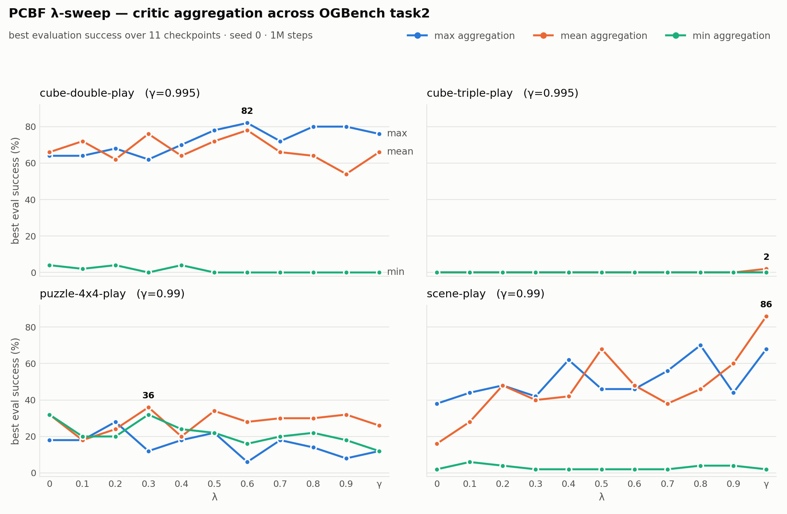

<h1 align="center">Path-Coupled Bellman Flows for Distributional Reinforcement Learning</h1>

<p align="center">
  Official implementation of <b>Path-Coupled Bellman Flows for Distributional Reinforcement Learning</b>
  <br>
  <i>ICML 2026</i>
</p>

<p align="center">
  <a href="https://arxiv.org/abs/2605.08253"></a>
  <a href="https://github.com/BoyangASU/path-coupled-bellman-flows"></a>
  <a href="https://icml.cc"></a>
</p>

<p align="center">
  
  <br>
  <em><b>Figure 1.</b> Architecture of Path-Coupled Bellman Flows (PCBF). A shared noise variable is propagated along the Bellman path, producing a path-consistent flow-matching objective for return distributions.</em>
</p>

<p align="center">
  
  <br>
  <em><b>Figure 2.</b> Demonstration of the trained agent using Path-Coupled Bellman Flows on Discrete MC Environment.</em>
</p>

## Overview

Path-Coupled Bellman Flows (PCBF) introduces a flow-based perspective for distributional reinforcement learning. Rather than treating each return as an independent sample, PCBF couples the noise along a Bellman trajectory, yielding a path-consistent flow-matching objective for the return distribution. The method was accepted as a regular-track paper at ICML 2026.

**Core idea.** Standard flow matching learns a velocity field that transports Gaussian noise $\epsilon$ into return samples. The distributional Bellman equation says the current return equals reward plus a discounted successor return: $Z(s,a) \stackrel{d}{=} R + \gamma Z(s',a')$. PCBF exploits this by using the *same* noise $\epsilon$ to generate both current and successor returns, so their flow paths are geometrically coupled:

$$Z_t^{s'} = (1-t)\cdot \epsilon + t\cdot X', \qquad Z_t^{s} = t\cdot R + \tilde{\gamma}\cdot Z_t^{s'} + (1-t)(1-\tilde{\gamma})\cdot \epsilon$$

Both paths start from the same $\epsilon$ at $t=0$ and reach their Bellman-related endpoints at $t=1$. Differentiating gives the BCFM velocity target $Y = R + \tilde{\gamma}X' - \epsilon$, which is unbiased but high-variance because it depends on the noisy sample $X'$.

PCBF reduces this variance with a control variate built from the successor velocity field, yielding a $\lambda$-parameterized family of targets:

$$u = Y + \lambda\cdot C, \qquad C = v_{\theta^-}(t,\, Z_t^{s'} \mid s', a') - (X' - \epsilon)$$

- $\lambda = 0$: pure BCFM — unbiased, high variance
- $\lambda > 0$: replaces noisy $X'$ with smoother velocity predictions, reducing variance with small controlled bias
- $\lambda = \gamma$: fully eliminates $X'$ from the target

The shared-noise coupling ensures the bias from $\lambda > 0$ is small — scaling as $O((1-\gamma)(1-t))$ under Gaussian analysis — making the bias–variance trade-off favorable in practice.
## Installation

1. Create an Anaconda environment: `conda create -n PCBF python=3.10.13 -y`
2. Activate the environment: `conda activate PCBF`
3. Install the dependencies:

```bash
conda install -c conda-forge glew -y
conda install -c conda-forge mesalib -y
pip install -r requirements.txt
```

## Usage

```bash
# PCBF on OGBench cube-double-play (γ=0.995, λ=0.4)
python main.py --env_name=cube-double-play-singletask-{task1,task2,task3,task4,task5}-v0 --agent=agents/lambda_flow.py --agent.discount=0.995 --agent.lambda_param=0.4

# PCBF on OGBench cube-triple-play (γ=0.995, λ=0.995)
python main.py --env_name=cube-triple-play-singletask-{task1,task2,task3,task4,task5}-v0 --agent=agents/lambda_flow.py --agent.discount=0.995 --agent.lambda_param=0.995

# PCBF on OGBench scene-play (γ=0.99, λ=0.2)
python main.py --env_name=scene-play-singletask-{task1,task2,task3,task4,task5}-v0 --agent=agents/lambda_flow.py --agent.discount=0.99 --agent.lambda_param=0.2

# PCBF on OGBench puzzle-4x4-play (γ=0.99, λ=0.2)
python main.py --env_name=puzzle-4x4-play-singletask-{task1,task2,task3,task4,task5}-v0 --agent=agents/lambda_flow.py --agent.discount=0.99 --agent.lambda_param=0.2

# PCBF on D4RL hammer-cloned (γ=0.99, λ=0.8)
python main.py --env_name=hammer-cloned-v1 --agent=agents/lambda_flow.py --agent.discount=0.99 --agent.lambda_param=0.8

# PCBF on D4RL hammer-expert (γ=0.99, λ=0.9)
python main.py --env_name=hammer-expert-v1 --agent=agents/lambda_flow.py --agent.discount=0.99 --agent.lambda_param=0.9

# PCBF on OGBench visual-antmaze-teleport (γ=0.99, λ=0.0)
python main.py --env_name=visual-antmaze-teleport-navigate-singletask-{task1,task2,task3,task4,task5}-v0 --p_aug=0.5 --frame_stack=3 --agent=agents/lambda_flow.py --agent.discount=0.99 --agent.lambda_param=0.0 --agent.encoder=impala_small

# PCBF on OGBench visual-cube-double-play (γ=0.995, λ=0.9)
python main.py --env_name=visual-cube-double-play-singletask-{task1,task2,task3,task4,task5}-v0 --p_aug=0.5 --frame_stack=3 --agent=agents/lambda_flow.py --agent.discount=0.995 --agent.lambda_param=0.9 --agent.encoder=impala_small
```

## Hyperparameters

Domain-level hyperparameters from the paper (Table 5). λ is tuned per domain on the task marked with *.

| Domain | γ | λ |
|---|---|---|
| cube-double-play | 0.995 | 0.4 |
| cube-triple-play | 0.995 | 0.995 |
| puzzle-4x4-play | 0.99 | 0.2 |
| scene-play | 0.99 | 0.2 |
| visual-antmaze-teleport | 0.99 | 0.0 |
| visual-cube-double-play | 0.995 | 0.9 |

D4RL Adroit uses per-task λ; see `scripts/run_d4rl.sh` for details.

<details>
<summary><b>Common hyperparameters (click to expand)</b></summary>

| Hyperparameter | Value |
|---|---|
| Optimizer | Adam |
| Learning rate | 3×10⁻⁴ |
| Batch size | 256 |
| MLP hidden dims | (512, 512, 512, 512) |
| Activation | GELU |
| Layer norm | Yes |
| Flow steps (Euler) | 10 |
| Rejection sampling candidates | 16 |
| Target network τ | 0.005 |
| Q ensembles | 2 |

</details>

## Results

### OGBench Environments
<p align="center">
  
  <figcaption align="center">
    <b>Figure 3.</b> OGBench Tasks.
  </figcaption>
</p>

### Offline RL (Table 1)

| Domain | IQN | CODAC | FQL | IQL | Value Flows | **PCBF** |
|---|---|---|---|---|---|---|
| cube-double-play | 42±8 | 61±6 | 29±6 | 7±1 | 69±4 | **71±5** |
| scene-play | 40±1 | 55±1 | 56±2 | 28±3 | **59±4** | 54±4 |
| puzzle-4x4-play | 27±4 | 20±18 | 17±5 | 7±2 | 27±4 | **30±4** |
| cube-triple-play | 6±0 | 2±1 | 4±2 | 1±1 | **14±3** | 4±1 |
| D4RL adroit | 66±5 | 69±0 | **71±4** | 70 | 65±2 | 69±2 |

Bold = within 95% of best. Results averaged over 8 seeds.

### Reproduction with this codebase

Numbers produced by this repository on a single A100 (OGBench only). Per-run score is the average of `evaluation/success` over the final three evaluation checkpoints (800K / 900K / 1M) — the protocol in Appendix H — so these columns are directly comparable to the paper's.

The critic-ensemble aggregation is a free choice the paper does not pin down, and `agents/lambda_flow.py` exposes it as two separate flags: `--agent.ret_agg` combines the two return samples inside the λ-target during critic training, and `--agent.q_agg` combines Q₁/Q₂ when `sample_actions` picks the best of its N candidate actions. Both were set to the same value here.

| Domain | `max` agg | `mean` agg | Paper (Table 3) |
|---|---:|---:|---:|
| cube-double-play (5 tasks) | 53 ± 7 | 47 ± 7 | **71 ± 5** |
| scene-play (5 tasks) † | 48 ± 4 | 45 ± 3 | **54 ± 4** |
| puzzle-4x4-play (5 tasks) † | 22 ± 5 | 23 ± 5 | **30 ± 4** |
| cube-triple-play (5 tasks) † | 3 ± 1 | 3 ± 1 | **4 ± 1** |
| **all 20 tasks** | **31 ± 4** | 29 ± 4 | **40 ± 4** |

Mean ± std over 8 seeds. † = no true `max`-agg batch was run for that domain; both columns there are `mean`-agg and differ only by λ / re-run batch, so only the cube-double row is an actual max-vs-mean comparison. The reproduction falls short of the reported numbers on every domain, with the largest gap on cube-double-play.

<details>
<summary><b>Per-task breakdown (click to expand)</b></summary>

| Task | `max` agg | `mean` agg | Paper |
|---|---:|---:|---:|
| cube-double-play-singletask-task1 | 82 ± 6 | 73 ± 8 | 92 ± 3 |
| cube-double-play-singletask-task2 | 60 ± 9 | 44 ± 9 | 74 ± 7 |
| cube-double-play-singletask-task3 | 56 ± 6 | 44 ± 7 | 81 ± 8 |
| cube-double-play-singletask-task4 | 20 ± 6 | 10 ± 2 | 22 ± 5 |
| cube-double-play-singletask-task5 | 44 ± 9 | 64 ± 9 | 84 ± 3 |
| scene-play-singletask-task1 † | 100 ± 1 | 100 ± 0 | 100 ± 0 |
| scene-play-singletask-task2 † | 43 ± 15 | 30 ± 9 | 57 ± 13 |
| scene-play-singletask-task3 † | 95 ± 2 | 92 ± 3 | 98 ± 2 |
| scene-play-singletask-task4 † | 1 ± 1 | 2 ± 2 | 12 ± 3 |
| scene-play-singletask-task5 † | 0 ± 0 | 0 ± 0 | 2 ± 1 |
| puzzle-4x4-play-singletask-task1 † | 28 ± 5 | 30 ± 6 | 38 ± 6 |
| puzzle-4x4-play-singletask-task2 † | 20 ± 5 | 22 ± 3 | 23 ± 5 |
| puzzle-4x4-play-singletask-task3 † | 25 ± 4 | 24 ± 5 | 40 ± 4 |
| puzzle-4x4-play-singletask-task4 † | 26 ± 5 | 26 ± 7 | 28 ± 4 |
| puzzle-4x4-play-singletask-task5 † | 11 ± 4 | 11 ± 2 | 23 ± 3 |
| cube-triple-play-singletask-task1 † | 12 ± 5 | 12 ± 5 | 18 ± 4 |
| cube-triple-play-singletask-task2 † | 0 ± 0 | 0 ± 0 | 0 ± 1 |
| cube-triple-play-singletask-task3 † | 2 ± 1 | 1 ± 1 (7 seeds) | 1 ± 1 |
| cube-triple-play-singletask-task4 † | 0 ± 0 | 0 ± 0 | 0 ± 0 |
| cube-triple-play-singletask-task5 † | 0 ± 0 | 0 ± 0 (7 seeds) | 1 ± 1 |

Configuration behind the `max` column:

| Domain | `ret_agg` / `q_agg` | λ | γ |
|---|---|---:|---:|
| cube-double-play | max | 0.6 | 0.995 |
| scene-play | mean | 0.99 | 0.99 |
| puzzle-4x4-play | mean | 0.3 | 0.99 |
| cube-triple-play | mean | 0.995 | 0.995 |

</details>

### λ sweep

<p align="center">
  
  <br>
  <em><b>Figure 4.</b> Success rate against λ on task 2 of each domain, for the three critic aggregations.</em>
</p>

λ swept from 0 to γ in steps of 0.1 (with γ as the final point) on task 2 of each domain, `ret_agg = q_agg`, seed 0, 1M steps. Each cell is the **best** `evaluation/success` (%) over the 11 evaluation checkpoints, written as `max / mean / min`.

| λ | cube-double-play<br>(γ=0.995) | cube-triple-play<br>(γ=0.995) | puzzle-4x4-play<br>(γ=0.99) | scene-play<br>(γ=0.99) |
|---|---:|---:|---:|---:|
| 0 | 64 / 66 / 4 | 0 / 0 / 0 | 18 / 32 / 32 | 38 / 16 / 2 |
| 0.1 | 64 / 72 / 2 | 0 / 0 / 0 | 18 / 18 / 20 | 44 / 28 / 6 |
| 0.2 | 68 / 62 / 4 | 0 / 0 / 0 | 28 / 24 / 20 | 48 / 48 / 4 |
| 0.3 | 62 / 76 / 0 | 0 / 0 / 0 | 12 / 36 / 32 | 42 / 40 / 2 |
| 0.4 | 70 / 64 / 4 | 0 / 0 / 0 | 18 / 20 / 24 | 62 / 42 / 2 |
| 0.5 | 78 / 72 / 0 | 0 / 0 / 0 | 22 / 34 / 22 | 46 / 68 / 2 |
| 0.6 | **82** / **78** / 0 | 0 / 0 / 0 | 6 / 28 / 16 | 46 / 48 / 2 |
| 0.7 | 72 / 66 / 0 | 0 / 0 / 0 | 18 / 30 / 20 | 56 / 38 / 2 |
| 0.8 | 80 / 64 / 0 | 0 / 0 / 0 | 14 / 30 / 22 | **70** / 46 / 4 |
| 0.9 | 80 / 54 / 0 | 0 / 0 / 0 | 8 / 32 / 18 | 44 / 60 / 4 |
| 0.99 | – | – | 12 / 26 / 12 | 68 / **86** / 2 |
| 0.995 | 76 / 66 / 0 | 0 / **2** / 0 | – | – |

Best λ per domain, and the λ the paper selected:

| Domain | best λ (`max`) | best λ (`mean`) | best λ (`min`) | paper λ |
|---|---:|---:|---:|---:|
| cube-double-play | 0.6 (82%) | 0.6 (78%) | 0 (4%) | 0.4 |
| cube-triple-play | 0.1 (0%) | 0.995 (2%) | 0.1 (0%) | 0.995 |
| puzzle-4x4-play | 0.2 (28%) | 0.3 (36%) | 0 (32%) | 0.2 |
| scene-play | 0.8 (70%) | 0.99 (86%) | 0.1 (6%) | 0.2 |

Averaged over the whole λ grid, `max` and `mean` are close (34.9% vs 35.7% across domains) while `min` collapses (6.5%) — the pessimistic aggregation that works for scalar Q-ensembles is harmful here, since both flow samples share the same base noise and the minimum systematically truncates the return distribution. Note that this sweep is a single seed at one task per domain, so individual λ cells are noisy; only the broad shape (a usable 0.3–0.6 band on cube-double, the `min` collapse) is well supported.

### Distributional Accuracy (Toy Environments)

<p align="center">
  
  <figcaption align="center">
    <b>Figure 5.</b> Learned PCBF Maps on Toy Environments. Left Top
(Solitaire); Right Top (Bernoulli); and Bottom (Discrete MC).
  </figcaption>
</p>

### Comparison on Learned Distribution (Toy Environments)

<p align="center">
  
  <figcaption align="center">
    <b>Figure 6.</b> Distributional accuracy comparison on toy environments.
  </figcaption>
</p>

### Visualization of Learned Velocity Field (Toy Environments)

<p align="center">
  
  <figcaption align="center">
    <b>Figure 7.</b> Distributional Flow Analysis on the Discrete MC Environment. We visualize the learned PCBF return distributions across states s = 1 to s = 20. The estimated probability density of the flow-transported samples (blue filled) is compared against Ground Truth Monte Carlo rollouts(black dashed lines). Characteristic flow trajectories transporting random noise samples (t = 0) to the target return distribution (t = 1) over flow time. Trajectory colors distinguish individual particles sampled from the base distribution p(x0), illustrating how the model maps stochastic noise to specific return outcomes.
  </figcaption>
</p>

## Repository Structure

```
path-coupled-bellman-flows/
├── main.py                       # Training entry point (OGBench / D4RL)
├── agents/
│   ├── __init__.py               # Agent registry
│   └── lambda_flow.py            # PCBF agent (Algorithm 1)
├── envs/
│   ├── env_utils.py              # OGBench environment wrapper
│   └── d4rl_utils.py             # D4RL dataset loading
├── utils/
│   ├── datasets.py               # Dataset and replay buffer
│   ├── encoders.py               # IMPALA visual encoder
│   ├── evaluation.py             # Evaluation loop
│   ├── flax_utils.py             # TrainState, ModuleDict, save/restore
│   ├── log_utils.py              # CSV and W&B logging
│   └── networks.py               # MLP, ValueVectorField, ActorVectorField
├── toy/                          # Toy environment experiments
│   ├── agent/                    # PCBF agent for discrete envs
│   ├── gym_environments/         # Solitaire, Bernoulli, Discrete MC
│   ├── jax_models.py             # Velocity network
│   ├── jax_evaluation.py         # Evaluation utilities
│   ├── jax_utils.py              # JAX helper functions
│   └── run_training_jax.py       # Toy training script
├── figures/                      # Figures and GIFs
├── requirements.txt               
```

## Citation

```bibtex
@article{xu2026path,
  title={Path-Coupled Bellman Flows for Distributional Reinforcement Learning},
  author={Xu, Boyang and Zou, Qing and Yang, Siqin and Yan, Hao},
  journal={arXiv preprint arXiv:2605.08253},
  year={2026}
}
```

## Acknowledgements

This codebase is built on [FQL](https://github.com/seohongpark/fql) and [Value Flows](https://github.com/chongyi-zheng/value-flows). We thank Research Computing at Arizona State University for providing A100 GPU resources on the Sol supercomputer.

