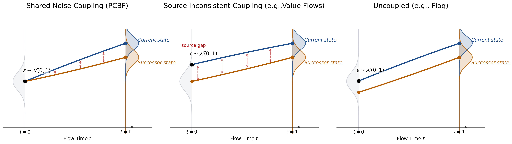
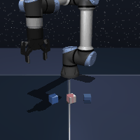
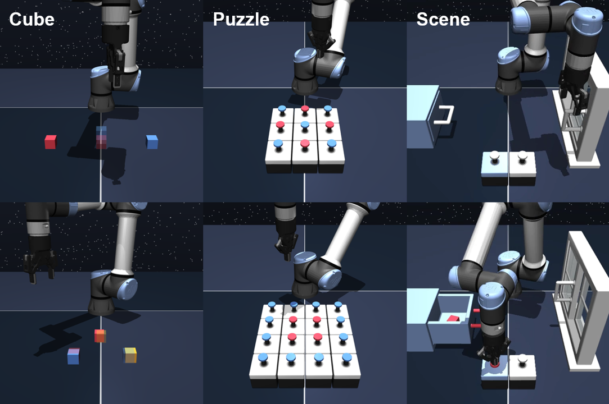
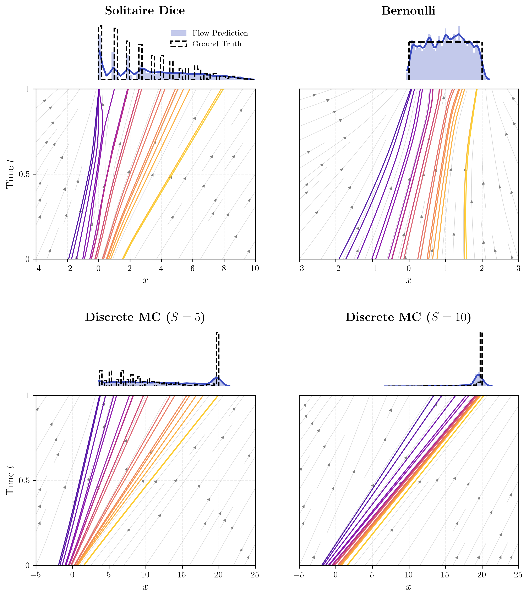
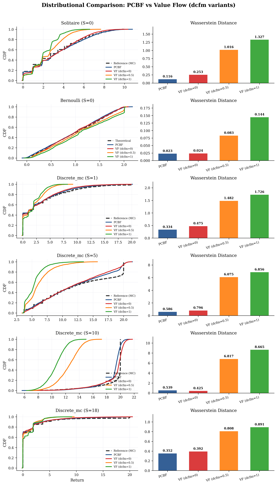

<h1 align="center">Path-Coupled Bellman Flows for Distributional Reinforcement Learning</h1>

<p align="center">
  Official implementation of <b>Path-Coupled Bellman Flows for Distributional Reinforcement Learning</b>
  <br>
  <i>ICML 2026</i>
</p>

<p align="center">
  <a href="https://arxiv.org/abs/2605.08253"></a>
  <a href="https://github.com/BoyangASU/path-coupled-bellman-flows"></a>
  <a href="https://icml.cc"></a>
</p>

<p align="center">
  
  <br>
  <em><b>Figure 1.</b> Architecture of Path-Coupled Bellman Flows (PCBF). A shared noise variable is propagated along the Bellman path, producing a path-consistent flow-matching objective for return distributions.</em>
</p>

<p align="center">
  
  <br>
  <em><b>Figure 2.</b> Demonstration of the trained agent using Path-Coupled Bellman Flows on Discrete MC Environment.</em>
</p>

<p align="center">
  
  <br>
  <em><b>Figure 3.</b> PCBF on OGBench <code>cube-double-play-singletask-task1-v0</code>: three successful episodes from the 1M-step checkpoint (γ=0.995, λ=0.4), rendered with <code>render_demo.py</code>.</em>
</p>

## Overview

Path-Coupled Bellman Flows (PCBF) introduces a flow-based perspective for distributional reinforcement learning. Rather than treating each return as an independent sample, PCBF couples the noise along a Bellman trajectory, yielding a path-consistent flow-matching objective for the return distribution. The method was accepted as a regular-track paper at ICML 2026.

**Core idea.** Standard flow matching learns a velocity field that transports Gaussian noise $\epsilon$ into return samples. The distributional Bellman equation says the current return equals reward plus a discounted successor return: $Z(s,a) \stackrel{d}{=} R + \gamma Z(s',a')$. PCBF exploits this by using the *same* noise $\epsilon$ to generate both current and successor returns, so their flow paths are geometrically coupled:

$$Z_t^{s'} = (1-t)\cdot \epsilon + t\cdot X', \qquad Z_t^{s} = t\cdot R + \tilde{\gamma}\cdot Z_t^{s'} + (1-t)(1-\tilde{\gamma})\cdot \epsilon$$

Both paths start from the same $\epsilon$ at $t=0$ and reach their Bellman-related endpoints at $t=1$. Differentiating gives the BCFM velocity target $Y = R + \tilde{\gamma}X' - \epsilon$, which is unbiased but high-variance because it depends on the noisy sample $X'$.

PCBF reduces this variance with a control variate built from the successor velocity field, yielding a $\lambda$-parameterized family of targets:

$$u = Y + \lambda\cdot C, \qquad C = v_{\theta^-}(t,\, Z_t^{s'} \mid s', a') - (X' - \epsilon)$$

- $\lambda = 0$: pure BCFM — unbiased, high variance
- $\lambda > 0$: replaces noisy $X'$ with smoother velocity predictions, reducing variance with small controlled bias
- $\lambda = \gamma$: fully eliminates $X'$ from the target

The shared-noise coupling ensures the bias from $\lambda > 0$ is small — scaling as $O((1-\gamma)(1-t))$ under Gaussian analysis — making the bias–variance trade-off favorable in practice.
## Installation

1. Create an Anaconda environment: `conda create -n PCBF python=3.10.13 -y`
2. Activate the environment: `conda activate PCBF`
3. Install the dependencies:

```bash
conda install -c conda-forge glew -y
conda install -c conda-forge mesalib -y
pip install -r requirements.txt
```

## Usage

Every experiment is a single call to `main.py`. A run is fully specified by the environment, the agent config file, and the two PCBF hyperparameters — `--agent.discount` (γ) and `--agent.lambda_param` (λ):

```bash
python main.py \
  --env_name=cube-double-play-singletask-task1-v0 \
  --agent=agents/lambda_flow.py \
  --agent.discount=0.995 \
  --agent.lambda_param=0.4 \
  --seed=0
```

Substitute `task1` → `task2` … `task5` for the other tasks in a domain. Output goes to `exp/<wandb_run_group>/<run_name>/`, containing `flags.json`, `train.csv`, and `eval.csv`; `evaluation/success` in `eval.csv` is the success rate at each evaluation checkpoint.

### Per-domain commands

γ and λ below are the paper's Table 5 values.

```bash
# OGBench, state-based
python main.py --env_name=cube-double-play-singletask-task1-v0 --agent=agents/lambda_flow.py --agent.discount=0.995 --agent.lambda_param=0.4
python main.py --env_name=cube-triple-play-singletask-task1-v0 --agent=agents/lambda_flow.py --agent.discount=0.995 --agent.lambda_param=0.995
python main.py --env_name=puzzle-4x4-play-singletask-task1-v0  --agent=agents/lambda_flow.py --agent.discount=0.99  --agent.lambda_param=0.2
python main.py --env_name=scene-play-singletask-task1-v0       --agent=agents/lambda_flow.py --agent.discount=0.99  --agent.lambda_param=0.2

# OGBench, pixel-based (image augmentation + frame stacking + IMPALA encoder)
python main.py --env_name=visual-antmaze-teleport-navigate-singletask-task1-v0 --agent=agents/lambda_flow.py --agent.discount=0.99  --agent.lambda_param=0.0 --agent.encoder=impala_small --p_aug=0.5 --frame_stack=3
python main.py --env_name=visual-cube-double-play-singletask-task1-v0          --agent=agents/lambda_flow.py --agent.discount=0.995 --agent.lambda_param=0.9 --agent.encoder=impala_small --p_aug=0.5 --frame_stack=3

# D4RL Adroit (λ is per task — see the Hyperparameters section)
python main.py --env_name=hammer-cloned-v1 --agent=agents/lambda_flow.py --agent.discount=0.99 --agent.lambda_param=0.8
python main.py --env_name=hammer-expert-v1 --agent=agents/lambda_flow.py --agent.discount=0.99 --agent.lambda_param=0.9
```

### Sweeping tasks and seeds

A domain is 5 tasks × 8 seeds. There is no launcher script in the repo — a plain shell loop (or your cluster's array-job equivalent) is enough:

```bash
for task in task1 task2 task3 task4 task5; do
  for seed in 0 1 2 3 4 5 6 7; do
    python main.py \
      --env_name=cube-double-play-singletask-${task}-v0 \
      --agent=agents/lambda_flow.py \
      --agent.discount=0.995 --agent.lambda_param=0.4 \
      --seed=${seed} \
      --wandb_run_group=cube_double_${task}
  done
done
```

### Rendering demo GIFs

`main.py` writes a checkpoint every `--save_interval` steps (default: once, at 1M). `render_demo.py` restores one, rolls out episodes, and writes the successful ones to a GIF — the environment and agent hyperparameters are read back from the run's own `flags.json`, so only the run directory is needed:

```bash
MUJOCO_GL=egl python render_demo.py \
  --run_dir=exp/cube_double_task1/sd000_.../ \
  --restore_epoch=1000000 \
  --num_episodes=30 --num_keep=3 \
  --frame_skip=4 --fps=15 --scale=1 \
  --out=figures/demo_cube_double_task1.gif
```

That is the exact command behind Figure 3. `MUJOCO_GL=egl` is required on headless (no-display) machines. Rollout stops as soon as `--num_keep` episodes have succeeded, and the shortest ones are written first; pass `--keep_failures` to pad the GIF with the longest-surviving failures instead. OGBench manipulation environments render at 200×200 and their MJCF caps the offscreen framebuffer there, so `--scale` upsamples afterwards rather than rendering larger.

### Frequently used flags

| Flag | Default | Meaning |
|---|---|---|
| `--env_name` | `antmaze-large-navigate-v0` | OGBench (`*-singletask-*`) or D4RL dataset name |
| `--agent` | `agents/value_flows.py` | Agent config file; use `agents/lambda_flow.py` for PCBF |
| `--agent.discount` | `0.99` | Discount γ |
| `--agent.lambda_param` | `0.0` | Control-variate weight λ; `0` = BCFM, valid range `[0, γ]` |
| `--agent.ret_agg` | `max` | Combines the two target return samples in the λ-target (`max` / `mean` / `min`) |
| `--agent.q_agg` | `max` | Combines Q₁/Q₂ when `sample_actions` picks among its candidates (`max` / `mean` / `min`) |
| `--agent.num_samples` | `16` | Candidate actions per rejection-sampling step |
| `--agent.num_flow_steps` | `10` | Euler steps used to integrate the flow |
| `--agent.encoder` | `None` | Visual encoder, e.g. `impala_small` (pixel-based tasks only) |
| `--seed` | `0` | Random seed |
| `--train_steps` | `1000000` | Gradient steps |
| `--eval_interval` | `100000` | Steps between evaluations (11 checkpoints over a 1M-step run) |
| `--eval_episodes` | `50` | Episodes per evaluation |
| `--save_dir` | `exp/` | Output root |
| `--wandb_run_group` | `debug` | Subdirectory under `--save_dir`, also the W&B group name |
| `--enable_wandb` | `0` | Set to `1` to log to Weights & Biases |

## Hyperparameters

Domain-level hyperparameters from the paper (Table 5). λ is tuned per domain on the task marked with *.

| Domain | γ | λ |
|---|---|---|
| cube-double-play | 0.995 | 0.4 |
| cube-triple-play | 0.995 | 0.995 |
| puzzle-4x4-play | 0.99 | 0.2 |
| scene-play | 0.99 | 0.2 |
| visual-antmaze-teleport | 0.99 | 0.0 |
| visual-cube-double-play | 0.995 | 0.9 |

D4RL Adroit tunes λ per task instead of per domain (γ = 0.99 throughout):

| Task | λ | | Task | λ |
|---|---:|---|---|---:|
| pen-cloned-v1 | 0.7 | | door-cloned-v1 | 0.5 |
| pen-expert-v1 | 0.7 | | door-expert-v1 | 0.99 |
| hammer-cloned-v1 | 0.8 | | relocate-cloned-v1 | 0.99 |
| hammer-expert-v1 | 0.9 | | relocate-expert-v1 | 0.99 |

<details>
<summary><b>Common hyperparameters (click to expand)</b></summary>

| Hyperparameter | Value |
|---|---|
| Optimizer | Adam |
| Learning rate | 3×10⁻⁴ |
| Batch size | 256 |
| MLP hidden dims | (512, 512, 512, 512) |
| Activation | GELU |
| Layer norm | Yes |
| Flow steps (Euler) | 10 |
| Rejection sampling candidates | 16 |
| Target network τ | 0.005 |
| Q ensembles | 2 |

</details>

## Results

### OGBench Environments
<p align="center">
  
  <figcaption align="center">
    <b>Figure 4.</b> OGBench Tasks.
  </figcaption>
</p>

### OGBench Success Rates

160 runs on a single A100 — 4 state-based domains × 5 tasks × 8 seeds, 1M steps each, evaluated on 50 episodes every 100K steps. Per seed the score is the best single evaluation checkpoint; each task reports the max over its 8 seeds, the seed that reached it, and the checkpoint it came from, alongside the mean ± std across all 8 seeds. Task names are abbreviated — the full environment id is `<domain>-singletask-<task>-v0`.

| Task | Max over 8 seeds | Best seed | Ckpt | Mean ± std |
|---|---:|:---:|---:|---:|
| cube-double-play-task1 | 100 | s4 | 500K | 93 ± 5 |
| cube-double-play-task2 | 84 | s5 | 900K | 77 ± 5 |
| cube-double-play-task3 | 76 | s1 | 700K | 70 ± 5 |
| cube-double-play-task4 | 40 | s0 | 800K | 30 ± 7 |
| cube-double-play-task5 | 66 | s3 | 1000K | 56 ± 9 |
| **cube-double-play (5 tasks)** | **73.2** | | | **65 ± 6** |
| scene-play-task1 | 100 | s0 | 300K | 100 ± 0 |
| scene-play-task2 | 100 | s7 | 600K | 86 ± 11 |
| scene-play-task3 | 100 | s2 | 800K | 99 ± 1 |
| scene-play-task4 | 8 | s1 | 300K | 3 ± 3 |
| scene-play-task5 | 0 | — | — | 0 ± 0 |
| **scene-play (5 tasks)** | **61.6** | | | **58 ± 3** |
| puzzle-4x4-play-task1 | 50 | s5 | 300K | 39 ± 6 |
| puzzle-4x4-play-task2 | 36 | s1 | 800K | 28 ± 4 |
| puzzle-4x4-play-task3 | 52 | s3 | 400K | 38 ± 6 |
| puzzle-4x4-play-task4 | 40 | s2 | 400K | 35 ± 5 |
| puzzle-4x4-play-task5 | 30 | s0 | 900K | 18 ± 6 |
| **puzzle-4x4-play (5 tasks)** | **41.6** | | | **32 ± 5** |
| cube-triple-play-task1 | 46 | s5 | 400K | 25 ± 9 |
| cube-triple-play-task2 | 2 | s0 | 1000K | 0 ± 1 |
| cube-triple-play-task3 | 6 | s6 | 1000K | 3 ± 2 |
| cube-triple-play-task4 | 2 | s1 | 400K | 0 ± 1 |
| cube-triple-play-task5 | 2 | s3 | 900K | 0 ± 1 |
| **cube-triple-play (5 tasks)** | **11.6** | | | **6 ± 3** |
| **all 20 tasks** | **47.0** | | | **40 ± 4** |

Bold rows aggregate over the tasks they follow: each entry is the average of the per-task values above it, so the `Mean ± std` column averages the per-task means and the per-task standard deviations separately.

Configuration behind these runs:

| Domain | λ | γ | `ret_agg` / `q_agg` |
|---|---:|---:|:---:|
| cube-double-play | 0.6 | 0.995 | `max` |
| scene-play | 0.99 | 0.99 | `mean` |
| puzzle-4x4-play | 0.3 | 0.99 | `mean` |
| cube-triple-play | 0.995 | 0.995 | `mean` |

### Distributional Accuracy (Toy Environments)

<p align="center">
  
  <figcaption align="center">
    <b>Figure 5.</b> Learned PCBF Maps on Toy Environments. Left Top
(Solitaire); Right Top (Bernoulli); and Bottom (Discrete MC).
  </figcaption>
</p>

### Comparison on Learned Distribution (Toy Environments)

<p align="center">
  
  <figcaption align="center">
    <b>Figure 6.</b> Distributional accuracy comparison on toy environments.
  </figcaption>
</p>

### Visualization of Learned Velocity Field (Toy Environments)

<p align="center">
  
  <figcaption align="center">
    <b>Figure 7.</b> Distributional Flow Analysis on the Discrete MC Environment. We visualize the learned PCBF return distributions across states s = 1 to s = 20. The estimated probability density of the flow-transported samples (blue filled) is compared against Ground Truth Monte Carlo rollouts(black dashed lines). Characteristic flow trajectories transporting random noise samples (t = 0) to the target return distribution (t = 1) over flow time. Trajectory colors distinguish individual particles sampled from the base distribution p(x0), illustrating how the model maps stochastic noise to specific return outcomes.
  </figcaption>
</p>

## Repository Structure

```
path-coupled-bellman-flows/
├── main.py                       # Training entry point (OGBench / D4RL)
├── render_demo.py                # Roll out a checkpoint and save a demo GIF
├── agents/
│   ├── __init__.py               # Agent registry
│   ├── lambda_flow.py            # PCBF agent (Algorithm 1)
│   └── ...                       # Baselines: c51, codac, fbrac, fql, ifql,
│                                 #            iql, iqn, rebrac, value_flows
├── envs/
│   ├── env_utils.py              # OGBench environment wrapper
│   └── d4rl_utils.py             # D4RL dataset loading
├── utils/
│   ├── datasets.py               # Dataset and replay buffer
│   ├── encoders.py               # IMPALA visual encoder
│   ├── evaluation.py             # Evaluation loop
│   ├── flax_utils.py             # TrainState, ModuleDict, save/restore
│   ├── log_utils.py              # CSV and W&B logging
│   └── networks.py               # MLP, ValueVectorField, ActorVectorField
├── toy/                          # Toy environment experiments
│   ├── agent/                    # PCBF agent for discrete envs
│   ├── gym_environments/         # Solitaire, Bernoulli, Discrete MC
│   ├── jax_models.py             # Velocity network
│   ├── jax_evaluation.py         # Evaluation utilities
│   ├── jax_utils.py              # JAX helper functions
│   └── run_training_jax.py       # Toy training script
├── figures/                      # Figures and GIFs
└── requirements.txt
```

## Citation

```bibtex
@article{xu2026path,
  title={Path-Coupled Bellman Flows for Distributional Reinforcement Learning},
  author={Xu, Boyang and Zou, Qing and Yang, Siqin and Yan, Hao},
  journal={arXiv preprint arXiv:2605.08253},
  year={2026}
}
```

## Acknowledgements

This codebase is built on [FQL](https://github.com/seohongpark/fql) and [Value Flows](https://github.com/chongyi-zheng/value-flows). We thank Research Computing at Arizona State University for providing A100 GPU resources on the Sol supercomputer.

